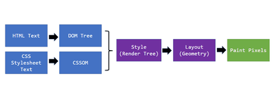
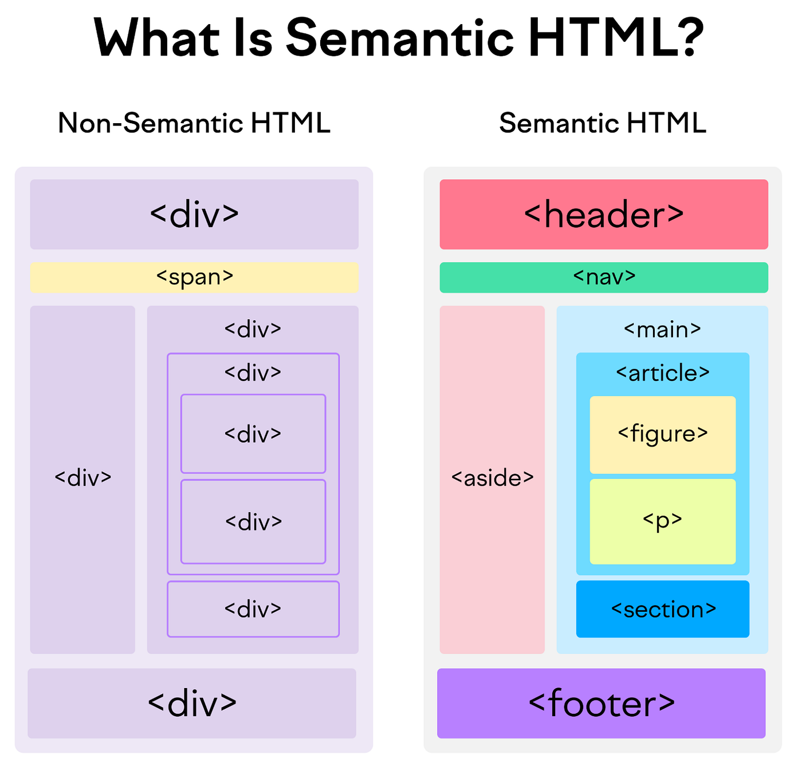
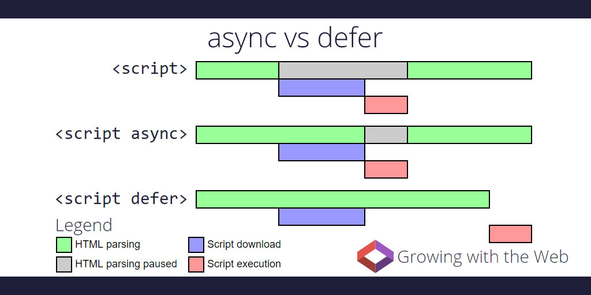

# 🌐 HTML Interview Preparation

## 🧱 Part 1 — Browser Internals & Rendering

### ❓ How does a browser render a webpage?

### 📝 Answer

When a browser receives HTML from a server, it **does not immediately show it on the screen**.
Instead, it follows a strict internal pipeline to understand _what_ to show and _how_ to show it.

🔍 **Step-by-step breakdown**

1. **HTML Parsing** — Browser reads HTML top to bottom and converts it into a tree-like structure called the **DOM (Document Object Model)**.
2. **CSS Parsing** — CSS files are parsed into another tree called the **CSSOM**, which determines styles like colors, fonts, and layout.
3. **Render Tree Creation** — DOM + CSSOM are merged. Invisible elements (`display: none`) are excluded.
4. **Layout (Reflow)** — Browser calculates **exact position and size** of each element based on viewport, fonts, and flex/grid rules.
5. **Paint** — Pixels are drawn (colors, text, borders).
6. **Compositing** — Layers are combined and sent to the GPU for display.



```text
HTML → DOM
CSS  → CSSOM
DOM + CSSOM → Render Tree → Layout → Paint → Composite
```

> 💡 **Key Takeaway**
>
> - Changing `width`, `height`, `top`, `left` → triggers **reflow** (expensive — recalculates layout)
> - Changing `color`, `background`, `visibility` → triggers **repaint** (cheaper)
> - Changing `transform`, `opacity` → only **compositing** (cheapest, GPU-accelerated)

#### ↳ **Follow-up:** Why does `transform: translateX(...)` perform better than `left: ...`?

↪ Because `transform` skips layout and paint and only re-composites the layer on the GPU. `left` triggers a full reflow.

---

#### ↳ Follow-up: Can you walk me through the Critical Rendering Path and why it matters for performance?
### 📝 Answer

The **Critical Rendering Path (CRP)** is the sequence of steps the browser must complete to render the **first pixel** on screen.

```text
HTML → DOM
CSS  → CSSOM   (BLOCKS rendering)
JS   → Can BLOCK parsing
↓
Render Tree → Layout → Paint
```

> ⚠️ **Important Rules**
>
> - **CSS is render-blocking** by default. The browser will not paint anything until all CSS is parsed.
> - **JS is parser-blocking** by default. A `<script>` tag pauses HTML parsing until it loads and runs.

✅ **Optimizations**

- Inline critical CSS (above-the-fold styles)
- Use `defer` or `async` for non-critical JS
- Lazy-load images and below-the-fold content
- Use `<link rel="preload">` for critical assets

---

## 🏷️ Part 2 — Semantic HTML & Structure

### ❓ What does "semantic HTML" mean?

### 📝 Answer

Semantic HTML means **using HTML tags that describe the meaning of content**, not just how it looks.

The browser, search engines, and screen readers rely on semantics to understand **structure and intent**.

❌ **Non-semantic**

```html
<div class="header"></div>
<div class="nav"></div>
```

✅ **Semantic**

```html
<header></header>
<nav></nav>
```

**Common semantic elements**

| Tag         | Meaning             |
| ----------- | ------------------- |
| `<header>`  | Intro or header     |
| `<nav>`     | Navigation links    |
| `<main>`    | Primary content     |
| `<section>` | Grouped topic       |
| `<article>` | Independent content |
| `<aside>`   | Side content        |
| `<footer>`  | Footer info         |
| `<figure>`  | Self-contained media with optional caption |
| `<time>`    | Machine-readable date/time |



🧠 **Why semantics matter**

- Screen readers announce landmarks
- SEO crawlers rank content better
- Developers understand structure faster

> 📌 **Rule of thumb**: If an element has _meaning_, don't use `<div>`.

---

### ❓ Difference between `<div>` and `<span>`?

### 📝 Answer

Both are **non-semantic** elements, but they differ in **display behavior**.

| Feature      | `<div>`     | `<span>`            |
| ------------ | ----------- | ------------------- |
| Display      | Block-level | Inline              |
| New line     | Yes         | No                  |
| Width/Height | Allowed     | Not effective       |
| Usage        | Layout      | Inline text styling |

```html
<div>This starts on a new line</div>
<span>This stays inline</span>
```

> 📌 Use `<div>` for structure, `<span>` for inline tweaks.

---

### ❓ Difference between `id` and `class`?

### 📝 Answer

They are identifiers, but serve **very different purposes**.

| Feature      | `id`    | `class`             |
| ------------ | ------- | ------------------- |
| Unique       | Yes     | No                  |
| Reusable     | ❌      | ✅                  |
| CSS Selector | `#id`   | `.class`            |
| JS Access    | Fast (`getElementById`) | Multiple elements (`getElementsByClassName`) |
| Specificity  | Higher (100) | Lower (10)     |

```html
<div id="main"></div>
<div class="card"></div>
<div class="card"></div>
```

---

### ❓ Difference between `<section>`, `<article>`, and `<div>`?
### 📝 Answer

| Tag         | When to Use |
| ----------- | ----------- |
| `<section>` | A thematic grouping of content, **usually with a heading** |
| `<article>` | Self-contained content that makes sense **on its own** (e.g., blog post, news item) |
| `<div>`     | Generic, **non-semantic** wrapper used for styling or layout only |

✅ **Quick test**

- Could it be syndicated as RSS? → `<article>`
- Has its own heading and is part of a bigger page? → `<section>`
- Just for layout? → `<div>`

```html
<article>
  <header>
    <h1>Blog Title</h1>
  </header>
  <section>
    <h2>Introduction</h2>
    <p>...</p>
  </section>
</article>
```

---

## 🧩 Part 3 — Attributes & Data

### ❓ What are `data-*` attributes?

### 📝 Answer

`data-*` attributes let you attach **custom data** to HTML elements without affecting layout or semantics.

```html
<button data-user-id="42" data-action="delete">Click</button>
```

```js
const btn = document.querySelector('button');
btn.dataset.userId;   // "42"
btn.dataset.action;   // "delete"
```

🧠 **Why they exist**

- Clean separation of HTML & JS
- Avoid hidden inputs or global variables
- Easily readable & writable from JS

📌 **Use cases**

- User IDs, feature flags, state markers
- Component configuration
- Test selectors (`data-testid`)

---

### ❓ Difference between `<script>`, `async`, and `defer`?

### 📝 Answer

```html
<script src="a.js"></script>
<script async src="b.js"></script>
<script defer src="c.js"></script>
```

| Type   | HTML Parsing | Execution Timing | Order Preserved? |
| ------ | ------------ | ---------------- | ---------------- |
| Normal | **Blocks**   | Immediate        | Yes              |
| async  | Continues    | When ready (interrupts parsing) | ❌ No |
| defer  | Continues    | After DOM is parsed (`DOMContentLoaded`) | ✅ Yes |



> 🎯 **Rule of thumb**
>
> - `defer` → for scripts that depend on DOM (most cases)
> - `async` → for analytics, ads, independent third-party scripts
> - Plain `<script>` at end of `<body>` → legacy fallback

---

### ❓ How would you explain the difference between preload, prefetch, and preconnect — and when would you reach for each?
### 📝 Answer

These are **resource hints** that help the browser optimize loading.

| Hint          | Purpose                                            | When to Use |
| ------------- | -------------------------------------------------- | ----------- |
| `preconnect`  | Open early connection (DNS + TCP + TLS) to a domain | Third-party origins (CDN, fonts) |
| `preload`     | Download a critical resource early, high priority  | Hero image, fonts, critical CSS |
| `prefetch`    | Download a low-priority resource for the next page | Likely next-page navigation |

```html
<link rel="preconnect" href="https://fonts.googleapis.com" />
<link rel="preload" href="/hero.jpg" as="image" />
<link rel="prefetch" href="/next-page.js" />
```

> ⚠️ Don't overuse `preload` — it competes with critical resources and can slow things down.

---

## ♿ Part 4 — Accessibility (a11y)

### ❓ How do you approach accessibility (a11y) in HTML, and what does it mean to you in practice?

### 📝 Answer

Accessibility ensures websites are usable by everyone, including:

- Screen reader users
- Keyboard-only users
- Visually impaired users
- Users with motor or cognitive disabilities

**Key HTML practices**

- Use semantic tags (`<button>`, `<nav>`, `<main>`)
- Provide proper labels (`<label for="...">`)
- Maintain logical heading order (`h1 → h2 → h3`)
- Add `alt` text to images
- Ensure color contrast meets WCAG AA (4.5:1)

```html
<label for="email">Email</label>
<input id="email" type="email" />


  <!-- decorative: empty alt -->
```

> 📌 Accessibility is **not optional** — it's a legal requirement in many countries (ADA, EAA, AODA).

---

#### ↳ Follow-up: What are ARIA attributes?

### 📝 Answer

**ARIA (Accessible Rich Internet Applications)** adds **extra meaning** when HTML alone isn't enough.

```html
<button aria-label="Close dialog">X</button>
<div role="alert" aria-live="polite">Form saved!</div>
```

**Common ARIA attributes**

| Attribute       | Purpose                                   |
| --------------- | ----------------------------------------- |
| `aria-label`    | Accessible name when no visible text      |
| `aria-labelledby` | Reference another element for the name |
| `aria-describedby` | Reference an element for description  |
| `aria-hidden`   | Hide element from screen readers          |
| `aria-live`     | Announce dynamic content changes          |
| `role`          | Define element semantics                  |

> ⚠️ **Golden Rule**: **Semantic HTML first, ARIA second.** Misusing ARIA can make accessibility _worse_.

---

## 🧬 Part 5 — DOM, Performance & Modern Features

### ❓ Difference between DOM and Virtual DOM?

### 📝 Answer

| DOM             | Virtual DOM     |
| --------------- | --------------- |
| Browser-managed | JS-managed (React, Vue) |
| Direct updates  | Batched, diffed updates |
| Slower for many writes | Faster via reconciliation |

🧠 Virtual DOM minimizes costly DOM operations by computing a minimal diff in memory and applying it in one batch.

> 💡 Modern frameworks like Svelte and Solid skip the Virtual DOM entirely and compile to direct DOM updates — sometimes even faster.

---

### ❓ What are Web Components?

### 📝 Answer

Web Components allow you to create **custom HTML elements** with isolated styles and behavior — built into the browser, **no framework required**.

```js
class MyCard extends HTMLElement {
  connectedCallback() {
    this.attachShadow({ mode: "open" });
    this.shadowRoot.innerHTML = `<style>p { color: red; }</style><p>Hello</p>`;
  }
}
customElements.define("my-card", MyCard);
```

```html
<my-card></my-card>
```

✅ **Three pillars of Web Components**

1. **Custom Elements** — define new HTML tags
2. **Shadow DOM** — encapsulated styles/markup
3. **HTML Templates** — reusable markup with `<template>`

✅ **Benefits**: native, framework-agnostic, encapsulated, reusable.

---

#### ↳ Follow-up: What is the `<template>` and `<slot>` element?
### 📝 Answer

**`<template>`** holds inert HTML that is **not rendered** until cloned via JavaScript.

**`<slot>`** is a Web Components feature that defines a **placeholder** for projected content.

```html
<template id="card-template">
  <div class="card">
    <h2><slot name="title">Default Title</slot></h2>
    <p><slot>Default content</slot></p>
  </div>
</template>
```

```js
const tpl = document.getElementById('card-template');
document.body.appendChild(tpl.content.cloneNode(true));
```

> 💡 `<template>` is similar to Angular's `<ng-template>` — both define markup that doesn't render until activated.

---

## 🔍 Part 6 — SEO

### ❓ How does HTML structure impact SEO?

### 📝 Answer

Search engines analyze **HTML structure**, not visuals.

✅ **Best practices**

- One `<h1>` per page (the page's main topic)
- Proper heading hierarchy (`h1 → h2 → h3`, never skip levels)
- Semantic tags (`<main>`, `<article>`, `<nav>`)
- Descriptive `<title>` and `<meta name="description">`
- Use `<a href>` (not `<div onclick>`) for navigation
- Add `alt` text to images

```html
<h1>Main Topic</h1>
<h2>Sub Topic</h2>
<h3>Detail</h3>
```

> ⚠️ Poor structure = poor ranking.

---

#### ↳ Follow-up: What is the difference between `<meta>` tags for SEO and Open Graph?
### 📝 Answer

| Meta Type      | Used By              | Example |
| -------------- | -------------------- | ------- |
| Standard SEO   | Search engines       | `<meta name="description" content="...">` |
| Open Graph     | Facebook, LinkedIn, Slack | `<meta property="og:title" content="...">` |
| Twitter Cards  | Twitter / X          | `<meta name="twitter:card" content="summary_large_image">` |

```html
<!-- SEO -->
<title>My Page</title>
<meta name="description" content="A page about HTML interview prep" />

<!-- Open Graph -->
<meta property="og:title" content="My Page" />
<meta property="og:image" content="https://example.com/preview.jpg" />
<meta property="og:type" content="article" />

<!-- Twitter -->
<meta name="twitter:card" content="summary_large_image" />
```

> 💡 These control how your page appears when shared on social media.

---

# 🎯 Trick Questions & Mock Scenarios

> The questions interviewers use to **test real understanding** and **catch shallow knowledge**.

---

### ❓ Is ARIA better than semantic HTML?

### 📝 Answer

❌ **No. ARIA is a fallback, not a replacement.**

- Native HTML is always preferred
- ARIA overrides default semantics

```html
<button>Submit</button>          <!-- ✅ Better -->
<div role="button">Submit</div>  <!-- ❌ Worse -->
```

> ⚠️ **Golden rule**: _"Use ARIA only when HTML can't do the job."_

---

### ❓ Does HTML support multithreading?

### 📝 Answer

❌ **No.**

- HTML parsing is **single-threaded** (main thread)
- Script execution blocks parsing (unless `defer`/`async`)
- Rendering pipeline depends on ordered execution

> 🧠 **Why it matters**: Blocking scripts = slow page load.
> ✅ **Workaround**: Offload heavy compute to **Web Workers** (separate thread).

---

### ❓ Why does broken HTML still work?

### 📝 Answer

Because HTML is **fault-tolerant by design**.

```html
<p>Hello
<div>World</div>
```

Browser auto-corrects:

- Closes `<p>`
- Maintains valid DOM structure

🎯 This ensures backward compatibility on the web — pages from 1995 still load today.

---

### ❓ Does `display: none` remove an element from the DOM?

### 📝 Answer

❌ **No.**

- Element stays in the DOM
- Removed from layout and accessibility tree
- JavaScript can still access it
- No reflow when re-shown

```css
display: none;     /* hidden, not in layout */
visibility: hidden;/* hidden, but takes space */
opacity: 0;        /* invisible, takes space, still clickable */
```

#### ↳ **Follow-up:** Difference between `display: none` and `hidden` attribute?

↪ Both hide the element. `hidden` is overridable by CSS (`display: block` wins). `display: none` is enforced by CSS specificity.

---

# 🚨 Mock Interview Scenarios

### ❓ We're getting complaints that the page feels slow, but the HTML is pretty small. Where would you start debugging?

### 📝 Answer

- Blocking `<script>` tags without `defer` / `async`
- Render-blocking CSS files in `<head>`
- Excessive DOM nesting (deep trees slow down layout)
- Reflow-heavy layouts (lots of inline styles or frequent JS DOM writes)
- Large images without `loading="lazy"` or compression
- Missing `<link rel="preconnect">` to third-party domains
- Heavy fonts blocking text rendering (use `font-display: swap`)

---

### ❓ A QA engineer filed a bug — screen reader users are hearing content in the wrong order. How would you investigate that?

### 📝 Answer

- Check semantic tags (avoid `<div>` for buttons, links, etc.)
- Heading hierarchy (`h1 → h2 → h3`, never skip)
- Misuse of `aria-hidden` or `tabindex="-1"` on important content
- Hidden content with `display: none` (not announced) vs `visibility: hidden`
- DOM order should match visual order (avoid `flex-direction: row-reverse` for important content)

---

### ❓ Our mobile users are seeing a broken layout, but everything looks fine on desktop. What would you look for?

### 📝 Answer

- Missing viewport meta tag: `<meta name="viewport" content="width=device-width, initial-scale=1">`
- Fixed pixel widths instead of `%` or `rem`
- Flexbox direction issues (no `flex-direction: column` on mobile)
- Overflow caused by large elements (use `overflow-x: hidden` on body if needed)
- Images not constrained (`max-width: 100%; height: auto;`)

---

### ❓ A user reported they can't operate our form using only the keyboard — the buttons aren't responding. What could be causing that?

### 📝 Answer

- Using `<div>` instead of `<button>` (no native focus, no Enter/Space handling)
- Missing `tabindex="0"` on custom interactive elements
- Incorrect ARIA roles (`role="button"` without keyboard handlers)
- Focus styles removed (`outline: none` without replacement)

```html
<!-- ❌ Bad -->
<div onclick="submit()">Submit</div>

<!-- ✅ Good -->
<button type="button" onclick="submit()">Submit</button>
```

---

### ❓ After a major redesign, our SEO rankings dropped significantly. What HTML-related things would you investigate?

### 📝 Answer

- Lost semantic structure (replaced `<article>`/`<section>` with `<div>`)
- Multiple `<h1>` or skipped heading levels
- Removed `<main>` landmark
- Content wrapped in non-semantic `<div>`s
- Hidden text abuse (Google penalizes)
- Slow page speed (Core Web Vitals affect ranking)
- Missing `<title>` or `<meta description>`

---

### ❓ After a dynamic DOM update, click handlers on some elements stop working. Why does this happen and how would you fix it?

### 📝 Answer

- DOM replaced dynamically (`innerHTML = ...`) — listeners lost
- Need **event delegation** on a parent element

```js
// ❌ Breaks after DOM update
document.querySelectorAll('.btn').forEach(b => b.addEventListener('click', ...));

// ✅ Survives DOM updates
document.body.addEventListener('click', (e) => {
  if (e.target.matches('.btn')) handleClick(e);
});
```

---

### ❓ Our page scores poorly on CLS in Lighthouse. Walk me through how you'd reduce it.
### 📝 Answer

**CLS** measures unexpected layout movement. To reduce it:

- Always set `width` and `height` on `` and `<video>` (or use `aspect-ratio` in CSS)
- Reserve space for ads, embeds, and dynamic content
- Avoid inserting content above existing content (use `position: fixed/absolute` for banners)
- Use `font-display: optional` or preload critical fonts to avoid FOUT/FOIT
- Avoid animations that change layout properties (use `transform` instead)

```html

```

> 💡 CLS is one of the three **Core Web Vitals** (along with LCP and INP).

---
