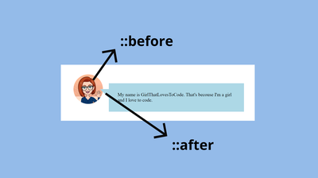
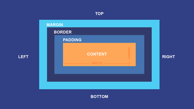
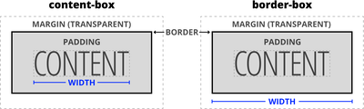
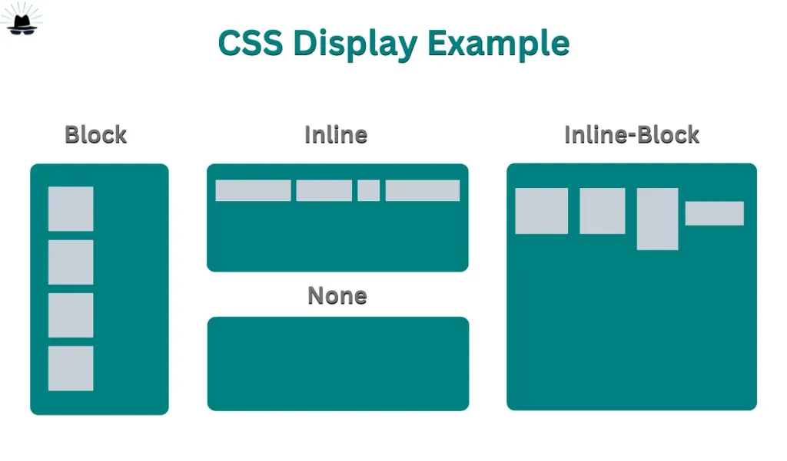
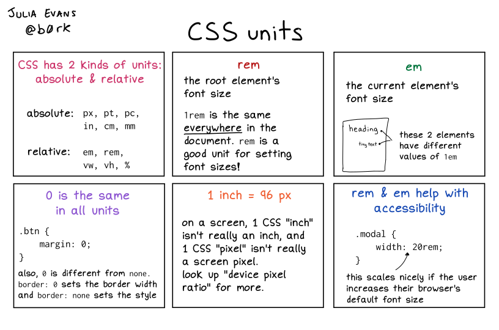
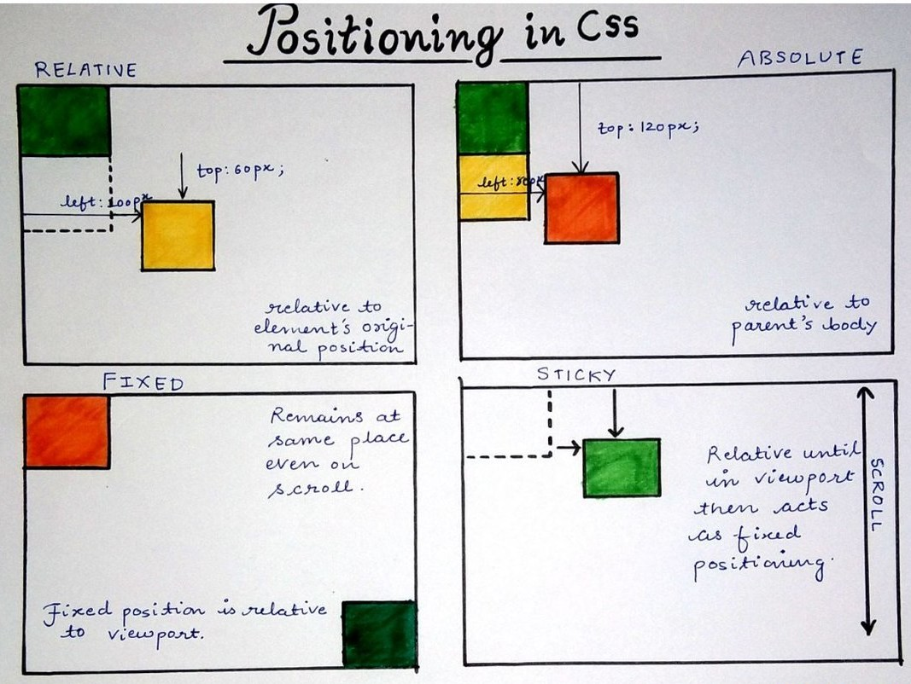
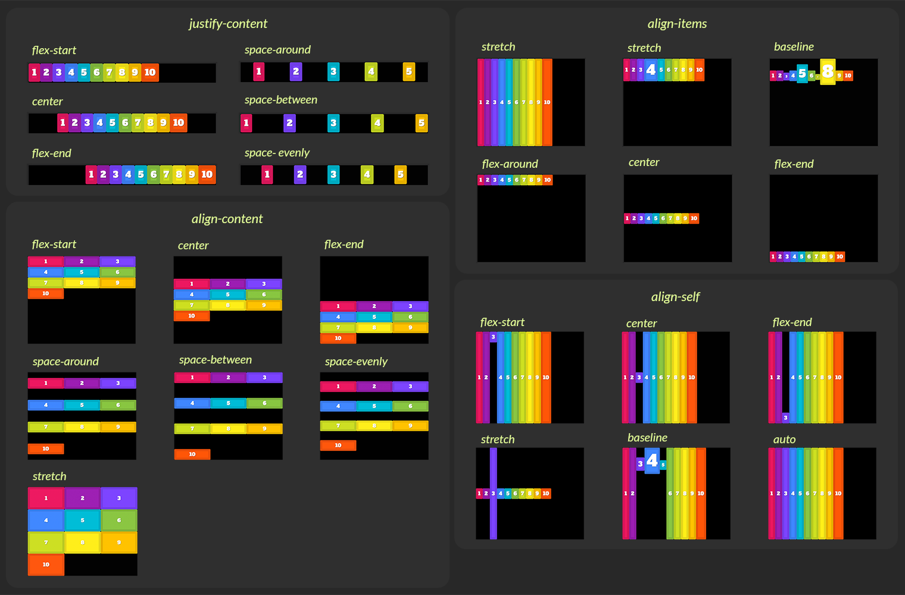
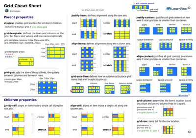

# 🎨 CSS Interview Preparation

---

# 🧱 Part 1 — Fundamentals

### ❓ In simple terms, what is CSS and how does it relate to HTML?

### 📝 Answer

CSS (**Cascading Style Sheets**) describes **how elements should look** — colors, spacing, layout, and positioning.

- HTML defines _structure_
- CSS defines _presentation_
- CSS is **declarative**: you describe **rules**, and the browser decides **how to apply them**

---

### ❓ How does the browser decide which styles to apply?

### 📝 Answer

CSS follows a **cascade** — a priority system that resolves conflicts:

```text
Browser default
↓
External CSS
↓
Internal CSS (<style>)
↓
Inline styles (style="...")
↓
!important
```

The browser resolves conflicts using these rules **in order**:

1. **Origin & importance** (user-agent → author → `!important`)
2. **Specificity** (stronger selector wins)
3. **Source order** (later rule wins if specificity is equal)

```html
<p id="text" class="highlight">Hello CSS</p>
```

```css
p              { color: blue; }    /* (0,0,0,1) */
.highlight     { color: green; }   /* (0,0,1,0) */
#text          { color: orange; }  /* (0,1,0,0) */
#text          { color: purple; }  /* same specificity, later wins */
```

✅ **Final color: purple**

---

### ❓ How do inline, internal, and external styles differ?

### 📝 Answer

```html
<!-- Inline -->
<div style="color: red"></div>

<!-- Internal -->
<style>
  div { color: blue; }
</style>

<!-- External -->
<link rel="stylesheet" href="styles.css" />
```

- **Inline** styles apply directly to the element (highest specificity except `!important`)
- **Internal** styles live in `<style>` tags (page-scoped)
- **External** styles live in `.css` files (cacheable, scalable, **preferred**)

---

### ❓ What are CSS selectors and what types are available?

### 📝 Answer

Selectors define **which elements** a style rule applies to.

```css
/* Element */         p {}
/* Class */           .card {}
/* ID */              #header {}
/* Attribute */       input[type="text"] {}
/* Group */           h1, h2 {}
/* Universal */       * {}
/* Descendant */      .card p {}
/* Child */           .card > p {}
/* Adjacent sibling */ h1 + p {}
/* General sibling */ h1 ~ p {}
```

> 📌 Classes are reusable, IDs are unique, attribute selectors are powerful but slower if overused.

---

### ❓ Descendant vs child selectors

### 📝 Answer

```css
.parent .child   { color: red;  }  /* any depth */
.parent > .child { color: blue; }  /* direct child only */
```

```html
<div class="parent">
  <div>
    <p class="child">Hello</p>  <!-- ✅ matches .parent .child only -->
  </div>
</div>
```

| Selector             | Matches                  |
| -------------------- | ------------------------ |
| `.parent .child`     | Any depth ✅             |
| `.parent > .child`   | Direct child only ✅     |

> ⚠️ Overusing descendant selectors makes CSS fragile and hard to refactor.

---

### ❓ What are pseudo-classes vs pseudo-elements?

### 📝 Answer

🔹 **Pseudo-class** → describes a **state** of an element

```css
button:hover       {}
input:focus        {}
li:first-child     {}
input:checked      {}
a:visited          {}
```

🔹 **Pseudo-element** → styles a **part** of an element

```css
p::first-line   {}
p::first-letter {}
p::before       { content: "→ "; }
p::after        { content: " ←"; }
::selection     {}
```

> 💡 **Mnemonic**
>
> - **Pseudo-class** → _state_ (single colon `:`)
> - **Pseudo-element** → _part_ (double colon `::`)



---

### ❓ Can you walk me through CSS specificity and how it affects style resolution?

### 📝 Answer

Specificity is the rule the browser uses to decide which CSS rule wins when **multiple rules target the same element**.

It is **not** random, **not** based on order, and **not** about selector length. It is a **priority system**.

**Specificity score: `(inline, ID, class, element)`**

| Selector            | Score       |
| ------------------- | ----------- |
| `p`                 | (0, 0, 0, 1) |
| `.card`             | (0, 0, 1, 0) |
| `[type="text"]`     | (0, 0, 1, 0) |
| `:hover`            | (0, 0, 1, 0) |
| `#app`              | (0, 1, 0, 0) |
| `#app .card p`      | (0, 1, 1, 1) |
| `style="color:red"` | (1, 0, 0, 0) |
| `!important`        | overrides all |

The browser compares from **left to right**. The first higher value wins.

**Example**

```css
#app           { color: green; }   /* (0,1,0,0) */
#app .card p   { color: red;   }   /* (0,1,1,1) ✅ wins */
```

---

#### ↳ Follow-up: Why is `!important` risky?

### 📝 Answer

```css
p { color: red !important; }
```

`!important` **breaks the natural cascade**. Once used, future overrides become harder and force more `!important` — a downward spiral.

> ⚠️ **Use only for**: utility classes, accessibility overrides, or fighting third-party CSS as a last resort.

---

# 📦 Part 2 — Box Model, Display & Units

### ❓ How does the CSS box model work?

### 📝 Answer

Every element is a rectangle made of:

```text
┌───────────────────────────┐
│        margin             │
│  ┌─────────────────────┐  │
│  │     border          │  │
│  │  ┌───────────────┐  │  │
│  │  │   padding     │  │  │
│  │  │  ┌─────────┐  │  │  │
│  │  │  │ content │  │  │  │
│  │  │  └─────────┘  │  │  │
│  │  └───────────────┘  │  │
│  └─────────────────────┘  │
└───────────────────────────┘
```



Misunderstanding this causes the **majority of layout bugs**.

---

### ❓ Difference between `content-box` and `border-box`?

### 📝 Answer

`box-sizing` controls **how the browser calculates an element's width and height**.

- **`content-box`** (default) → width/height apply to **content only**
- **`border-box`** → width/height include **content + padding + border**

```css
/* Content-box: total width = 200 + 20 + 4 = 224px */
.box-1 {
  box-sizing: content-box;
  width: 200px; padding: 10px; border: 2px solid;
}

/* Border-box: total width = 200px (content shrinks) */
.box-2 {
  box-sizing: border-box;
  width: 200px; padding: 10px; border: 2px solid;
}
```

| Property               | content-box | border-box       |
| ---------------------- | ----------- | ---------------- |
| Default behavior       | ✅ Yes      | ❌ No            |
| Width includes padding | ❌ No       | ✅ Yes           |
| Width includes border  | ❌ No       | ✅ Yes           |
| Easy layout math       | ❌ No       | ✅ Yes           |
| Preferred in real apps | ❌ Rarely   | ✅ Almost always |

> 💡 **One-Line Mental Model**
>
> - `content-box`: width = content only
> - `border-box`: width = the whole box

✅ **Best practice (universal reset)**

```css
*, *::before, *::after { box-sizing: border-box; }
```



---

### ❓ What are the different CSS display types?

### 📝 Answer

| Display        | Width Respected | Height Respected | Line Break |
| -------------- | --------------- | ---------------- | ---------- |
| `block`        | ✅              | ✅               | ✅         |
| `inline`       | ❌              | ❌               | ❌         |
| `inline-block` | ✅              | ✅               | ❌         |
| `flex`         | ✅              | ✅               | ✅ (block-level) |
| `grid`         | ✅              | ✅               | ✅ (block-level) |
| `none`         | —               | —                | Removed from layout |

> ⚠️ Inline elements ignore `width`/`height`. Many alignment issues come from using the wrong display type.



---

#### ↳ Follow-up: Where do `width` and `height` apply?

### 📝 Answer

| Element        | Width | Height |
| -------------- | ----- | ------ |
| block          | ✅    | ✅     |
| inline         | ❌    | ❌     |
| inline-block   | ✅    | ✅     |
| flex/grid item | ✅    | ✅     |

---

#### ↳ Follow-up: Why does `height: 100%` fail?

### 📝 Answer

Percentage heights work **only if the parent has an explicit height**. Without it, the browser cannot calculate the value.

```css
/* ❌ Doesn't work */
.parent { /* height: auto */ }
.child  { height: 100%; }

/* ✅ Works */
.parent { height: 500px; }
.child  { height: 100%; }
```

✅ **Modern alternative**: use `100dvh` (dynamic viewport height) or flex/grid.

---

### ❓ How do CSS units differ?

### 📝 Answer

| Unit  | Based On         | What It Means                  |
| ----- | ---------------- | ------------------------------ |
| `px`  | Fixed            | Absolute pixel, doesn't scale  |
| `em`  | Parent font-size | Relative to parent text        |
| `rem` | Root font-size   | Relative to `<html>`           |
| `%`   | Parent           | Percentage of parent dimension |
| `vw`  | Viewport width   | 1vw = 1% of viewport width     |
| `vh`  | Viewport height  | 1vh = 1% of viewport height    |
| `svh`/`dvh`/`lvh` | Viewport (smallest/dynamic/largest) | Mobile-safe heights |
| `fr`  | Fraction (Grid)  | Share of remaining space       |
| `ch`  | Character width  | Useful for text columns        |



**Practical Rule of Thumb**

| Use Case             | Best Unit  |
| -------------------- | ---------- |
| Body text            | `rem`      |
| Component spacing    | `rem`      |
| Borders, shadows     | `px`       |
| Full-screen sections | `dvh`      |
| Responsive widths    | `%` / `vw` |
| Grid columns         | `fr`       |

> 💡 Use `rem` for consistency, `em` for component-scoped sizing, `vh/dvh` for screens, `fr` for grids.

---

### ❓ Why is `100vh` tricky on mobile?

### 📝 Answer

Mobile browsers dynamically change viewport height when the address bar shows/hides. This causes **layout jumps** when using a`100vh`.

✅ **Modern fix**:

```css
.section { min-height: 100dvh; }  /* dynamic viewport height */
```

| Unit   | Behavior                                  |
| ------ | ----------------------------------------- |
| `100vh`| Largest viewport (when address bar hidden) |
| `100svh`| Smallest viewport (when address bar visible) |
| `100dvh`| Dynamic — adjusts as bar shows/hides     |
| `100lvh`| Largest viewport (alias of `vh`)         |

---

# 🎯 Part 3 — Positioning

### ❓ What CSS position types exist?

### 📝 Answer

```css
position: static;    /* default */
position: relative;
position: absolute;
position: fixed;
position: sticky;
```



| Position | In Flow? | Positioned Relative To | Notes |
| -------- | -------- | ---------------------- | ----- |
| `static` | ✅       | —                      | Default; `top`/`left` ignored |
| `relative` | ✅     | Itself                 | Creates positioning context for absolute children |
| `absolute` | ❌     | Nearest positioned ancestor | Removed from flow; parent height ignores it |
| `fixed`  | ❌       | Viewport               | Stays during scroll |
| `sticky` | ✅       | Scroll container       | Hybrid; fails if parent has `overflow: hidden/auto` |

```text
relative parent
 └── absolute child   ← positioned relative to parent
```

> 📌 **Common trap**: `absolute` looks for the nearest **positioned** ancestor (`relative`, `absolute`, `fixed`, `sticky`). If none exists, it positions relative to the `<html>` element.

---

### ❓ How does the `inset` shorthand work in CSS and what problem does it solve?

### 📝 Answer

`inset` is shorthand for `top`, `right`, `bottom`, `left` — used with `position: absolute/fixed/sticky`.

```css
.box {
  position: fixed;
  inset: 0;       /* equivalent to top:0; right:0; bottom:0; left:0; */
}

.box-2 {
  inset: 10px 20px;          /* top/bottom | left/right */
  inset: 10px 20px 30px;     /* top | left/right | bottom */
  inset: 10px 20px 30px 40px;/* top | right | bottom | left */
}
```

✅ Common use: full-screen overlay → `position: fixed; inset: 0;`

---

# 📐 Part 4 — Flexbox

### ❓ What problem does Flexbox solve?

### 📝 Answer

**Flexbox is a layout system designed to distribute space and align items along ONE direction at a time** — either a row or a column.

```text
flex-direction: row    →  Main axis horizontal, Cross axis vertical
flex-direction: column →  Main axis vertical,   Cross axis horizontal
```



The browser's job in Flexbox is:
> _"Given available space, how should items grow, shrink, and align?"_

**Two roles**

1. **Flex container** (parent) → `display: flex`
2. **Flex items** (direct children only)

---

#### ↳ Follow-up: Explain `flex-grow`, `flex-shrink`, `flex-basis`

### 📝 Answer

These three together decide **how items share available space**.

| Property      | Purpose                              | Default |
| ------------- | ------------------------------------ | ------- |
| `flex-basis`  | **Initial size** before grow/shrink  | `auto`  |
| `flex-grow`   | Share of **extra** space             | `0`     |
| `flex-shrink` | Share of **negative** space (when overflowing) | `1` |

**Shorthand**

```css
.item { flex: 1; }
/* equivalent to:
   flex-grow: 1;
   flex-shrink: 1;
   flex-basis: 0;     ← THIS is why width gets ignored
*/
```

> ⚠️ **`flex: 1` overrides `width`** because it sets `flex-basis: 0` ("ignore content, distribute equally").

✅ To preserve width:

```css
.item { flex: 0 0 300px; }   /* don't grow, don't shrink, base 300px */
```

---

#### ↳ Follow-up: Common Flexbox confusions

### 📝 Answer

❓ **`width` doesn't work?** — `flex-basis` is taking priority. Use `flex: 0 0 <width>`.

❓ **Items overflow?** — Default `min-width: auto` prevents shrinking below content size.
✅ Fix: `.item { min-width: 0; }`

❓ **Vertical centering fails?** — Confused main vs cross axis.
✅ For `flex-direction: row`: `align-items: center` (vertical), `justify-content: center` (horizontal).

---

#### ↳ Follow-up: `justify-content` vs `align-content` vs `align-items` vs `justify-self` vs `align-self`?

### 📝 Answer

| Property          | Axis             | Applies To       | Notes |
| ----------------- | ---------------- | ---------------- | ----- |
| `justify-content` | Main axis        | Container        | Distributes items along main axis |
| `align-items`     | Cross axis       | Container        | Aligns ALL items on cross axis |
| `align-content`   | Cross axis       | Container        | Distributes **rows** (only when wrapped) |
| `align-self`      | Cross axis       | Single item      | Overrides `align-items` for one item |
| `justify-self`    | Main axis        | Single item (Grid only) | Aligns one item along main axis |

> ⚠️ `align-content` only works when items wrap (`flex-wrap: wrap`).
> ⚠️ `justify-self` only works in **Grid**, not Flexbox.

```css
/* Container */
.container {
  display: flex;
  justify-content: center;  /* horizontal in row layout */
  align-items: center;      /* vertical in row layout */
}

/* Single item override */
.special-item {
  align-self: flex-end;
}
```

---

# 🔲 Part 5 — CSS Grid

### ❓ How does CSS Grid work, and how is it different from Flexbox?

### 📝 Answer

**Grid is a 2-dimensional layout system** — it controls rows AND columns at the same time.

```text
Flexbox: 1D (row OR column)
Grid:    2D (row AND column simultaneously)
```



- **Lines** — horizontal and vertical dividers
- **Tracks** — rows and columns (space between lines)
- **Cells** — single units (intersection of row and column)
- **Areas** — named groups of cells
- Items can **span** multiple rows or columns

---

#### ↳ Follow-up: Important Grid properties

### 📝 Answer

```css
.container {
  display: grid;
  grid-template-columns: 200px 1fr 1fr;     /* 3 columns */
  grid-template-rows: auto 1fr auto;         /* 3 rows */
  gap: 16px;                                 /* spacing */
  grid-template-areas:
    "header header header"
    "sidebar main main"
    "footer footer footer";
}

.item {
  grid-column: 1 / 3;       /* span columns 1 to 3 */
  grid-row: span 2;          /* span 2 rows */
  grid-area: header;         /* assign to named area */
}
```

**Powerful patterns**

```css
/* Auto-fit responsive grid (no media queries needed!) */
.responsive {
  display: grid;
  grid-template-columns: repeat(auto-fit, minmax(250px, 1fr));
  gap: 1rem;
}
```

| `auto-fit` vs `auto-fill` | Behavior |
| ---------------------------- | -------- |
| `auto-fit`  | Stretches items to fill empty space |
| `auto-fill` | Keeps empty tracks even when no items |

---

# 🌍 Part 6 — Logical Properties

### ❓ What are logical properties and why prefer them over physical ones?

### 📝 Answer

**Logical properties define layout based on content flow, not physical screen directions.** They adapt automatically to writing direction (LTR/RTL) and writing mode (horizontal/vertical).

**Two logical axes**

- **Inline axis** → direction text flows (LTR: left→right, RTL: right→left)
- **Block axis** → direction content stacks (top→bottom in horizontal modes)

```css
/* ❌ Physical (direction-dependent) */
margin-left: 16px;
padding-top: 8px;

/* ✅ Logical (direction-aware) */
margin-inline-start: 16px;
padding-block-start: 8px;
```

| Physical Property | Logical Equivalent    |
| ----------------- | --------------------- |
| `margin-left`     | `margin-inline-start` |
| `margin-right`    | `margin-inline-end`   |
| `padding-top`     | `padding-block-start` |
| `padding-bottom`  | `padding-block-end`   |
| `left`            | `inset-inline-start`  |
| `top`             | `inset-block-start`   |
| `width`           | `inline-size`         |
| `height`          | `block-size`          |

> 💡 **Use when**: building multilingual apps, supporting RTL languages (Arabic, Hebrew), creating reusable component libraries.

---

# ✨ Part 7 — Modern CSS

### ❓ What are CSS Custom Properties (Variables)?
### 📝 Answer

CSS Custom Properties allow you to define **reusable values** that can be inherited and updated dynamically.

```css
:root {
  --primary-color: #007bff;
  --spacing-md: 1rem;
}

.button {
  background: var(--primary-color);
  padding: var(--spacing-md);
}

/* Dynamic theming */
[data-theme="dark"] {
  --primary-color: #4dabf7;
}
```

✅ **Advantages over Sass variables**

- Live in the **browser** (can change at runtime via JS)
- **Inheritable** through the DOM
- Can be scoped to any selector

```js
// Update from JavaScript
document.documentElement.style.setProperty('--primary-color', '#ff0000');
```

---

### ❓ What are container queries?
### 📝 Answer

**Container queries let elements respond to their parent's size**, not the viewport's. This is huge for component-driven design.

```css
.card-container {
  container-type: inline-size;
  container-name: card;
}

@container card (min-width: 400px) {
  .card { display: flex; }
}

@container card (max-width: 399px) {
  .card { display: block; }
}
```

> 💡 Same component can render differently in a sidebar (narrow) vs main content (wide) — without media queries!

---

### ❓ Can you explain the `:has()` selector and give a real-world example of where you'd use it?
### 📝 Answer

**`:has()` is the "parent selector"** — it lets you style an element based on its descendants.

```css
/* Style a card differently if it contains an image */
.card:has(img) {
  padding: 0;
}

/* Style a form field that has an invalid input */
.field:has(input:invalid) {
  border-color: red;
}

/* Highlight a row when checkbox is checked */
tr:has(input[type="checkbox"]:checked) {
  background: lightyellow;
}
```

> 🔥 Game-changer for state-driven styling without JavaScript. Supported in all modern browsers since 2023.

---

### ❓ What's the difference between `*`, `:root`, and `body`?

### 📝 Answer

| Selector | What it affects | Key use                   |
| -------- | --------------- | ------------------------- |
| `*`      | Every element   | Resets (use sparingly)    |
| `:root`  | `<html>` element | CSS variables, `rem` base |
| `body`   | Page body       | Layout, fonts, background |

---

# ⚡ Part 8 — Performance & Animation

### ❓ Why do some animations feel janky?
### 📝 Answer

Animating layout properties forces the browser to **recalculate layout (reflow) and repaint** every frame — expensive at 60fps.

```css
/* ❌ Triggers reflow every frame */
.box { transition: width 0.3s, top 0.3s, margin 0.3s; }

/* ✅ Only triggers compositing — GPU accelerated */
.box { transition: transform 0.3s, opacity 0.3s; }
```

**Performance hierarchy**

```text
Layout (reflow)   ← most expensive (width, height, top, left, margin)
   ↓
Paint             ← medium     (color, background, box-shadow)
   ↓
Composite         ← cheapest   (transform, opacity)  ✅ animate these
```

✅ **`will-change` hint** (use sparingly):

```css
.box { will-change: transform; }
```

Tells browser to promote element to its own GPU layer in advance.

---

# 🎯 Trick Questions & Common Bugs

### ❓ Why styles sometimes don't apply?

### 📝 Answer

Common causes:

- Higher specificity elsewhere
- Inline styles win
- `!important` somewhere
- Shadow DOM encapsulation
- Incorrect selector
- CSS file not loaded (check Network tab)

> 💡 Most issues are not _missing_ CSS — they are _conflicting_ CSS.

---

### ❓ Why is `z-index` not working?

### 📝 Answer

```css
.parent { z-index: 1; }
.child  { z-index: 999; }   /* ❌ Has no effect */
```

`z-index` works **only on positioned elements** (`relative`, `absolute`, `fixed`, `sticky`).

✅ **Fix**

```css
.child {
  position: relative;
  z-index: 999;
}
```

> **Bonus**: `z-index` also works on flex/grid items even without `position`. And `transform`, `filter`, `opacity < 1` create new **stacking contexts** that can trap `z-index`.

---

### ❓ Why doesn't `text-overflow: ellipsis` work?

### 📝 Answer

Ellipsis works **only when ALL three conditions** are met:

```css
.text {
  width: 200px;             /* 1. Constrained width */
  overflow: hidden;          /* 2. Clip overflow */
  white-space: nowrap;       /* 3. Prevent wrapping */
  text-overflow: ellipsis;   /* 4. Show ellipsis */
}
```

 **Multi-line ellipsis**:

```css
.text {
  display: -webkit-box;
  -webkit-line-clamp: 2;
  -webkit-box-orient: vertical;
  overflow: hidden;
}
```

---

### ❓ Why does `position: sticky` fail?

### 📝 Answer

Sticky positioning depends on a **scrollable ancestor**.

❌ **Common breakers**

```css
.container { overflow: hidden; }   /* breaks sticky */
.container { overflow: auto; }     /* changes scroll context */
```

✅ **Fix**: Remove `overflow` clipping from ancestors, OR move sticky element outside.

> 💡 **Pro tip**: `position: sticky` sticks ONLY inside its scrolling ancestor — not the viewport, unless the document itself is the scroll container.

---

### ❓ Why does margin collapse happen?

### 📝 Answer

```css
.box1 { margin-bottom: 20px; }
.box2 { margin-top: 30px; }
```

Vertical margins of adjacent block elements **collapse** into a single margin — the browser uses the **largest**, not the sum.

✅ **Resulting margin: `30px`** (not `50px`)

**Margin collapse occurs in 3 scenarios**

1. Adjacent siblings (above)
2. Empty blocks (no content/padding/border)
3. Parent and first/last child (no separator)

✅ **How to prevent it**

- Add `padding` or `border` to the container
- Use `display: flex` or `grid` (no collapse in flex/grid)
- Use `overflow: auto` or `display: flow-root`

---

### ❓ Why do inline elements ignore width and height?

### 📝 Answer

```css
span { width: 200px; height: 100px; }   /* ❌ Ignored */
```

Inline elements flow with text and are **sized by content only**.

✅ **Fix**:

```css
span { display: inline-block; }   /* respects dimensions, stays inline */
```

---

### ❓ Why does `flex: 1` ignore width?

### 📝 Answer

```css
.item { width: 300px; flex: 1; }   /* width is ignored */
```

`flex: 1` expands to `flex-basis: 0`, which **overrides** `width`. Flexbox distributes available space equally.

✅ **Fix to preserve width**:

```css
.item { flex: 0 0 300px; }   /* don't grow, don't shrink, basis 300px */
```

---

### ❓ Why is `!important` not working here?

### 📝 Answer

```css
p { color: red !important; }
```

```html
<p style="color: blue">Text</p>   <!-- Stays blue -->
```

**Inline styles have higher specificity than external styles**, even with `!important`.

✅ **Override with**: `!important` on inline (rare), or use a more specific selector with `!important`, or remove the inline style.

> 💡 Order of importance: **author `!important`** > inline > author normal > user > user-agent.

---

### ❓ Why does this child selector not match?

### 📝 Answer

```css
.card > .title { color: red; }
```

```html
<div class="card">
  <div>
    <div class="title">Hello</div>   <!-- ❌ not direct child -->
  </div>
</div>
```

The `>` selector matches **only direct children**. `.title` here is a grandchild.

✅ **Fix**: Use descendant selector

```css
.card .title { color: red; }   /* matches at any depth */
```

---

### ❓ Why does `overflow: hidden` break dropdowns?

### 📝 Answer

`overflow: hidden` clips content outside the container. Dropdowns rely on overflowing content to extend beyond their parent.

✅ **Fix options**

- Move dropdown to `body` via portal/teleport (React, Vue)
- Use `position: fixed` for the dropdown
- Restructure layout to avoid the clipping ancestor

---

### ❓ Why does absolute positioning break layout height?

### 📝 Answer

Absolutely positioned elements are **removed from document flow**, so parents no longer calculate height based on them.

✅ **Fix**: Use `position: relative` or set explicit parent height.

---

### ❓ Why does Grid overflow unexpectedly?

### 📝 Answer

```css
.grid { grid-template-columns: 1fr 1fr; }
```

Grid items have a default `min-width: auto`, based on **content size**. Long content (long words, URLs) prevents shrinking.

✅ **Fix**:

```css
.grid > * { min-width: 0; }
```

> 💡 Same trap exists in Flexbox.

---

### ❓ Why does `:hover` not work on mobile?

### 📝 Answer

Touch devices don't have a true hover state. Browsers simulate it inconsistently after a tap.

✅ **Solution**: Design interactions that don't depend on hover. Use `:focus-visible` for keyboard, and consider `@media (hover: hover)` for hover-only styles.

```css
@media (hover: hover) {
  button:hover { background: red; }
}
```

---

### ❓ How would you build a sticky header inside a scroll container?
### 📝 Answer

```html
<div class="container">
  <div class="header">Sticky Header</div>
  <div class="content">Long scrolling content...</div>
</div>
```

```css
.container {
  height: 400px;
  overflow-y: auto;   /* scrolling ancestor */
}
.header {
  position: sticky;
  top: 0;
  background: black;
  color: white;
  z-index: 10;
}
```

> ⚠️ **Don't add `overflow: hidden` to any ancestor** — it breaks sticky.

---
